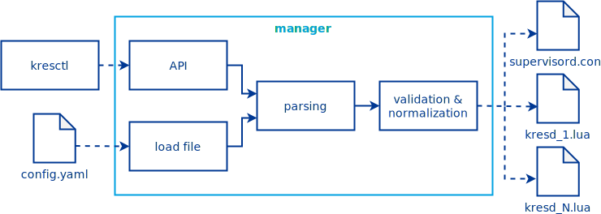

****************
``kres-manager``
****************

.. note::
    This guide is intended for advanced users and developers. You don't have to know and understand any of this to use Knot Resolver.

The manager is a component written in Python and a bit of C used for native extension modules. The main goal of the manager is to ensure the system is set up according to a given configuration, provide a user-friendly interface. Performance is only secondary to correctness.

The manager is mostly modelled around config processing pipeline:

d and other system components such as kresd.

API
===

The API server is implemented using `aiohttp <https://docs.aiohttp.org/en/stable>`_. This framework provides the application skeleton and manages application runtime. The manager is actually a normal web application with the slight difference that we don't save the data in a database but rather modify state of other processes.

Code of the API server is located only in a `single source code file <https://gitlab.nic.cz/knot/knot-resolver/-/blob/manager/manager/knot_resolver_manager/server.py>`_. It also contains description of the manager's startup procedure.

Config processing
=================

From the web framework, we receive data as simple strings and we need to parse and validate them. Due to packaging issues in distros, we rolled our own solution not disimilar to Python library `Pydantic <https://docs.pydantic.dev/>`_.

Our tool lets us model config schema similarly to how Python's native dataclasses are constructed. As input, it takes Python's dicts taken from PyYAML or JSON parser. The dict is mapped onto predefined Python classes while enforcing typing rules. If desired, the mapping step is performed multiple times onto different classes, which allows us to process intermediary values such as ``auto``.

There are two relevant places in the source code - `our generic modelling tools <https://gitlab.nic.cz/knot/knot-resolver/-/tree/manager/manager/knot_resolver_manager/utils/modeling>`_ and the actual `configuration data model <https://gitlab.nic.cz/knot/knot-resolver/-/tree/manager/manager/knot_resolver_manager/datamodel>`_. Just next to the data model in the ``templates`` directory, there are Jinja2 templates for generating Lua code from the configuration.

Actual manager
==============

The actual core of the whole application is originally named the manager. It keeps a high-level view of the systems state and performs all necessary operations to change the state to the desired one. In other words, manager is the component handling rolling restarts, config update logic and more.

The code is contained mainly in a `single source code file <https://gitlab.nic.cz/knot/knot-resolver/-/blob/manager/manager/knot_resolver_manager/kres_manager.py>`_.

Interactions with supervisord
=============================

.. note::
    Let's make a sidestep and let's talk about abstractions. The manager component mentioned above interacts with a general backend (or as we call sometimes call it - a subprocess manager). The idea is that the interactions with the backend are not dependent on the backend's implementation and we can choose which one we want to use. Historically, we had two different backend implementations - systemd and supervisord. However, systemd turned out to be inappropriate, it did not fit our needs, so we removed it. The `abstraction remains <https://gitlab.nic.cz/knot/knot-resolver/-/blob/manager/manager/knot_resolver_manager/kresd_controller/interface.py>`_ though and it should be possible to implement a different subprocess manager if it turns out useful. Please note though, the abstraction might be somewhat leaky in practice as there is only one implementation.

Communication with supervisord happens on pretty much all possible levels. We edit its configuration file, we use its XMLRPC API, we use Unix signals and we even attach to it from within its Python runtime. The interface is honestly a bit messy and we had to use all we could to make it user friendly.

First, we `generate supervisord's configuration file <https://gitlab.nic.cz/knot/knot-resolver/-/blob/manager/manager/knot_resolver_manager/kresd_controller/supervisord/supervisord.conf.j2>`_. The configuration file sets stage for further communication by specifying location of the pidfile and API Unix socket. It prepares configuration for subprocesses and most significantly, it loads our custom extensions.

`The extensions <https://gitlab.nic.cz/knot/knot-resolver/-/tree/manager/manager/knot_resolver_manager/kresd_controller/supervisord/plugin>`_ don't use a lot of code. There are four of them - the simplest one provides a speedier XMLRPC API for starting processes, it removes delays that are not necessary for our usecase. Another one implements systemd's ``sd_notify()`` API for supervisord, so we can track the lifecycle of ``kresd``s more precisely. Another extension changes the way logging works and the last extension monitors the lifecycle of the manager and forwards some signals.

.. note::
    The extensions mentioned above use monkeypatching to achieve their design goals. We settled for this approach, because supervisord's codebase appears mostly stable. The code we patch has not been changed for years. Other option would be forking supervisord and vendoring it. We decided against that mainly due to packaging complications it would cause with major Linux distributions.

For executing subprocesses, we don't actually change the configuration file, we only use XMLRPC API and tell supervisord to start already configured programs. For one specific call though, we use our extension instead of the build-in method of starting processes as it is significantly faster.