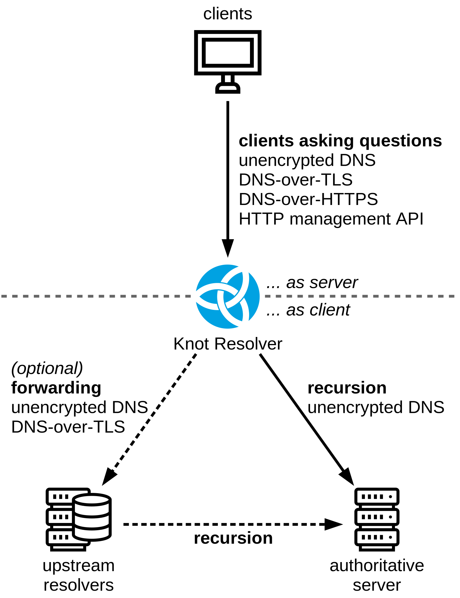

.. SPDX-License-Identifier: GPL-3.0-or-later

.. _network-configuration:

************************
Networking and protocols
************************

This section describes configuration of network interfaces
and protocols. Please keep in mind that DNS resolvers act
as *DNS server* and *DNS client* at the same time,
and that these roles require different configuration.

This picture illustrates different actors involved DNS resolution process,
supported protocols, and clarifies what we call *server configuration*
and *client configuration*.

*Attribution: Icons by Bernar Novalyi from the Noun Project*

For *resolver's clients* the resolver itself acts as a DNS server.

After receiving a query the resolver will attempt to find
answer in its cache. If the data requested by resolver's
client is not available in resolver's cache (so-called *cache-miss*)
the resolver will attempt to obtain the data from servers *upstream*
(closer to the source of information), so at this point the resolver
itself acts like a DNS client and will send DNS query to other servers.

By default the Knot Resolver works in recursive mode, i.e.
the resolver will contact authoritative servers on the Internet.
Optionally it can be configured in forwarding mode,
where cache-miss queries are *forwarded to another DNS resolver*
for processing.

Server (communication with clients)
===================================

.. toctree::
   :maxdepth: 2

   daemon-bindings-net_server
   daemon-bindings-net_tlssrv
   modules-http
   modules-http-doh

Client (retrieving answers from servers)
========================================

Following chapters describe basic configuration of how resolver retrieves data from other *(upstream)* servers. Data processing is also affected by configured policies, see chapter :ref:`policies` for more advanced usage.

.. toctree::
   :maxdepth: 2

   daemon-bindings-net_client
   config-network-forwarding

DNS protocol tweaks
===================

.. toctree::
   :maxdepth: 2

   daemon-bindings-net_dns_tweaks
