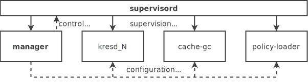

*******************
System architecture
*******************

Knot Resolver consists of several independent components that are managed by the ``manager`` which combines them into one functional unit.
The components are: ``kresd`` the resolving daemon, ``cache-gc`` the cache garbage collector, and ``policy-loader`` which loads configured policy rules.
In addition to these custom components, we also rely on `supervisord <http://supervisord.org/>`_, which handles the actual process management.

          Supervisord is a parent to all processes, namely manager, kresd instances and gc.
          Manager on the other hand controls every other component and what it does.

There are two different control structures in place.
Semantically, the manager controls every other component in Knot Resolver.
It processes configuration and passes it to each component.
As a user you will always interact with the manager.
At the same time though, the manager is not the root of the process hierarchy,
supervisord sits at the top of the process tree and runs everything else.

.. note::
    The reason for this inverted process hierarchy is mainly stability.
    Supervisord is at the top because it is a reliable and stable software that we can rely on.
    In addition, it does not process user input and is therefore shielded from data processing errors.
    This way, any component in Knot Resolver itself can recover from potential crashes without affecting the rest of the system.

Knot Resolver startup
=====================

The inverted process hierarchy makes the resolver startup procedure a bit more complicated.
You may notice this when reading the manager's logs immediately after startup.

What happens on cold start is:

1. The manager starts, reads its configuration and generates a new supervisord configuration.
   Then, it starts supervisord with the ``exec`` syscall, which causes supervisord to *replace* the manager process.
2. The supervisord loads its configuration, loads our custom extensions and starts a new instance of the manager.
3. The manager starts again, this time as a child of the supervisord instance.
   Since this is the desired state, it reloads the configuration again and instructs the supervisord to start the other components of the resolver.

Failure handling
================

Knot Resolver is designed to handle failures automatically.
Everything except the supervisord is automatically restarted after a failure.
If a failure is unrecoverable, all processes are killed and nothing is left behind in a half-broken state.
While a total failure like this should not happen, it is possible and you should not rely on specific instances of Knot Resolver in a highly-available system.

.. note::
    The ability to restart most of the components without downtime means that Knot Resolver can transparently apply updates while running.

Individual components
=====================

Learn more about the architecture of each component in the following chapters:

.. toctree::
    :titlesonly:
    :maxdepth: 1

    architecture-manager
    architecture-kresd
    architecture-gc
    architecture-pl
