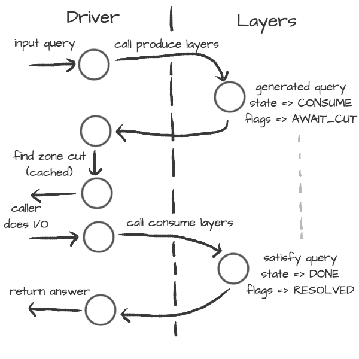

.. SPDX-License-Identifier: GPL-3.0-or-later

*********************
Knot Resolver library
*********************

Requirements
============

* libknot_ 2.0 (Knot DNS high-performance DNS library.)

For users
=========

The library as described provides basic services for name resolution, which should cover the usage,
examples are in the :ref:`resolve API <lib_api_rplan>` documentation.

.. tip:: If you're migrating from ``getaddrinfo()``, see *"synchronous"* API, but the library offers iterative API as well to plug it into your event loop for example.

.. _lib-layers:

For developers
==============

The resolution process starts with the functions in :ref:`resolve.c <lib_api_rplan>`, they are responsible for:

* reacting to state machine state (i.e. calling consume layers if we have an answer ready)
* interacting with the library user (i.e. asking caller for I/O, accepting queries)
* fetching assets needed by layers (i.e. zone cut)

This is the *driver*. The driver is not meant to know *"how"* the query resolves, but rather *"when"* to execute *"what"*.

On the other side are *layers*. They are responsible for dissecting the packets and informing the driver about the results. For example, a *produce* layer generates query, a *consume* layer validates answer.

.. tip:: Layers are executed asynchronously by the driver. If you need some asset beforehand, you can signalize the driver using returning state or current query flags. For example, setting a flag ``AWAIT_CUT`` forces driver to fetch zone cut information before the packet is consumed; setting a ``RESOLVED`` flag makes it pop a query after the current set of layers is finished; returning ``FAIL`` state makes it fail current query.

Layers can also change course of resolution, for example by appending additional queries.

.. code-block:: lua

	consume = function (state, req, answer)
		if answer:qtype() == kres.type.NS then
			local qry = req:push(answer:qname(), kres.type.SOA, kres.class.IN)
			qry.flags.AWAIT_CUT = true
		end
		return state
	end

This **doesn't** block currently processed query, and the newly created sub-request will start as soon as driver finishes processing current. In some cases you might need to issue sub-request and process it **before** continuing with the current, i.e. validator may need a DNSKEY before it can validate signatures. In this case, layers can yield and resume afterwards.

.. code-block:: lua

	consume = function (state, req, answer)
		if state == kres.YIELD then
			print('continuing yielded layer')
			return kres.DONE
		else
			if answer:qtype() == kres.type.NS then
				local qry = req:push(answer:qname(), kres.type.SOA, kres.class.IN)
				qry.flags.AWAIT_CUT = true
				print('planned SOA query, yielding')
				return kres.YIELD
			end
			return state
		end
	end

The ``YIELD`` state is a bit special. When a layer returns it, it interrupts current walk through the layers. When the layer receives it,
it means that it yielded before and now it is resumed. This is useful in a situation where you need a sub-request to determine whether current answer is valid or not.

Writing layers
==============

.. warning::  FIXME: this dev-docs section is outdated!  Better see comments in files instead, for now.

The resolver :ref:`library <lib_index>` leverages the processing API from the libknot to separate packet processing code into layers.

.. note:: This is only crash-course in the library internals, see the resolver :ref:`library <lib_index>` documentation for the complete overview of the services.

The library offers following services:

- :ref:`Cache <lib_api_cache>` - MVCC cache interface for retrieving/storing resource records.
- :ref:`Resolution plan <lib_api_rplan>` - Query resolution plan, a list of partial queries (with hierarchy) sent in order to satisfy original query. This contains information about the queries, nameserver choice, timing information, answer and its class.
- :ref:`Nameservers <lib_api_nameservers>` - Reputation database of nameservers, this serves as an aid for nameserver choice.

A processing layer is going to be called by the query resolution driver for each query,
so you're going to work with :ref:`struct kr_request <lib_api_rplan>` as your per-query context.
This structure contains pointers to resolution context, resolution plan and also the final answer.

.. code-block:: c

	int consume(kr_layer_t *ctx, knot_pkt_t *pkt)
	{
		struct kr_request *req = ctx->req;
		struct kr_query *qry = req->current_query;
	}

This is only passive processing of the incoming answer. If you want to change the course of resolution, say satisfy a query from a local cache before the library issues a query to the nameserver, you can use states (see the :ref:`Static hints <mod-hints>` for example).

.. code-block:: c

	int produce(kr_layer_t *ctx, knot_pkt_t *pkt)
	{
		struct kr_request *req = ctx->req;
		struct kr_query *qry = req->current_query;

		/* Query can be satisfied locally. */
		if (can_satisfy(qry)) {
			/* This flag makes the resolver move the query
			 * to the "resolved" list. */
			qry->flags.RESOLVED = true;
			return KR_STATE_DONE;
		}

		/* Pass-through. */
		return ctx->state;
	}

It is possible to not only act during the query resolution, but also to view the complete resolution plan afterwards. This is useful for analysis-type tasks, or *"per answer"* hooks.

.. code-block:: c

	int finish(kr_layer_t *ctx)
	{
		struct kr_request *req = ctx->req;
		struct kr_rplan *rplan = req->rplan;

		/* Print the query sequence with start time. */
		char qname_str[KNOT_DNAME_MAXLEN];
		struct kr_query *qry = NULL
		WALK_LIST(qry, rplan->resolved) {
			knot_dname_to_str(qname_str, qry->sname, sizeof(qname_str));
			printf("%s at %u\n", qname_str, qry->timestamp);
		}

		return ctx->state;
	}

APIs in Lua
===========

The APIs in Lua world try to mirror the C APIs using LuaJIT FFI, with several differences and enhancements.
There is not comprehensive guide on the API yet, but you can have a look at the bindings_ file.

Elementary types and constants
------------------------------

* States are directly in ``kres`` table, e.g. ``kres.YIELD, kres.CONSUME, kres.PRODUCE, kres.DONE, kres.FAIL``.
* DNS classes are in ``kres.class`` table, e.g. ``kres.class.IN`` for Internet class.
* DNS types are in  ``kres.type`` table, e.g. ``kres.type.AAAA`` for AAAA type.
* DNS rcodes types are in ``kres.rcode`` table, e.g. ``kres.rcode.NOERROR``.
* Packet sections (QUESTION, ANSWER, AUTHORITY, ADDITIONAL) are in the ``kres.section`` table.

Working with domain names
-------------------------

The internal API usually works with domain names in label format, you can convert between text and wire freely.

.. code-block:: lua

	local dname = kres.str2dname('business.se')
	local strname = kres.dname2str(dname)

Working with resource records
-----------------------------

Resource records are stored as tables.

.. code-block:: lua

	local rr = { owner = kres.str2dname('owner'),
	             ttl = 0,
	             class = kres.class.IN,
	             type = kres.type.CNAME,
	             rdata = kres.str2dname('someplace') }
	print(kres.rr2str(rr))

RRSets in packet can be accessed using FFI, you can easily fetch single records.

.. code-block:: lua

	local rrset = { ... }
	local rr = rrset:get(0) -- Return first RR
	print(kres.dname2str(rr:owner()))
	print(rr:ttl())
	print(kres.rr2str(rr))

Working with packets
--------------------

Packet is the data structure that you're going to see in layers very often. They consists of a header, and four sections: QUESTION, ANSWER, AUTHORITY, ADDITIONAL. The first section is special, as it contains the query name, type, and class; the rest of the sections contain RRSets.

First you need to convert it to a type known to FFI and check basic properties. Let's start with a snippet of a *consume* layer.

.. code-block:: lua

	consume = function (state, req, pkt)
		print('rcode:', pkt:rcode())
		print('query:', kres.dname2str(pkt:qname()), pkt:qclass(), pkt:qtype())
		if pkt:rcode() ~= kres.rcode.NOERROR then
			print('error response')
		end
	end

You can enumerate records in the sections.

.. code-block:: lua

	local records = pkt:section(kres.section.ANSWER)
	for i = 1, #records do
		local rr = records[i]
		if rr.type == kres.type.AAAA then
			print(kres.rr2str(rr))
		end
	end

During *produce* or *begin*, you might want to want to write to packet. Keep in mind that you have to write packet sections in sequence,
e.g. you can't write to ANSWER after writing AUTHORITY, it's like stages where you can't go back.

.. code-block:: lua

		pkt:rcode(kres.rcode.NXDOMAIN)
		-- Clear answer and write QUESTION
		pkt:recycle()
		pkt:question('\7blocked', kres.class.IN, kres.type.SOA)
		-- Start writing data
		pkt:begin(kres.section.ANSWER)
		-- Nothing in answer
		pkt:begin(kres.section.AUTHORITY)
		local soa = { owner = '\7blocked', ttl = 900, class = kres.class.IN, type = kres.type.SOA, rdata = '...' }
		pkt:put(soa.owner, soa.ttl, soa.class, soa.type, soa.rdata)

Working with requests
---------------------

The request holds information about currently processed query, enabled options, cache, and other extra data.
You primarily need to retrieve currently processed query.

.. code-block:: lua

	consume = function (state, req, pkt)
		print(req.options)
		print(req.state)

		-- Print information about current query
		local current = req:current()
		print(kres.dname2str(current.owner))
		print(current.stype, current.sclass, current.id, current.flags)
	end

In layers that either begin or finalize, you can walk the list of resolved queries.

.. code-block:: lua

	local last = req:resolved()
	print(last.stype)

As described in the layers, you can not only retrieve information about current query, but also push new ones or pop old ones.

.. code-block:: lua

		-- Push new query
		local qry = req:push(pkt:qname(), kres.type.SOA, kres.class.IN)
		qry.flags.AWAIT_CUT = true

		-- Pop the query, this will erase it from resolution plan
		req:pop(qry)

.. _libknot:  https://gitlab.labs.nic.cz/knot/knot-dns/tree/master/src/libknot
.. _bindings: https://gitlab.labs.nic.cz/knot/knot-resolver/blob/master/daemon/lua/kres.lua

.. _significant-lua-changes:

Significant Lua API changes
---------------------------

Incompatible changes since 3.0.0
~~~~~~~~~~~~~~~~~~~~~~~~~~~~~~~~

In the main ``kres.*`` lua binding, there was only change in struct knot_rrset_t:

- constructor now accepts TTL as additional parameter (defaulting to zero)
- add_rdata() doesn't accept TTL anymore (and will throw an error if passed)

In case you used knot_* functions and structures bound to lua:

- knot_dname_is_sub(a, b): knot_dname_in_bailiwick(a, b) > 0
- knot_rdata_rdlen(): knot_rdataset_at().len
- knot_rdata_data(): knot_rdataset_at().data
- knot_rdata_array_size(): offsetof(struct knot_data_t, data) + knot_rdataset_at().len
- struct knot_rdataset: field names were renamed to .count and .rdata
- some functions got inlined from headers, but you can use their kr_* clones:
  kr_rrsig_sig_inception(), kr_rrsig_sig_expiration(), kr_rrsig_type_covered().
  Note that these functions now accept knot_rdata_t* instead of a pair
  knot_rdataset_t* and size_t - you can use knot_rdataset_at() for that.

- knot_rrset_add_rdata() doesn't take TTL parameter anymore
- knot_rrset_init_empty() was inlined, but in lua you can use the constructor
- knot_rrset_ttl() was inlined, but in lua you can use :ttl() method instead

- knot_pkt_qname(), _qtype(), _qclass(), _rr(), _section() were inlined,
  but in lua you can use methods instead, e.g. myPacket:qname()
- knot_pkt_free() takes knot_pkt_t* instead of knot_pkt_t**, but from lua
  you probably didn't want to use that; constructor ensures garbage collection.

.. |---| unicode:: U+02014 .. em dash
